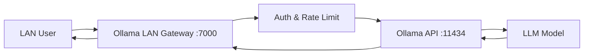
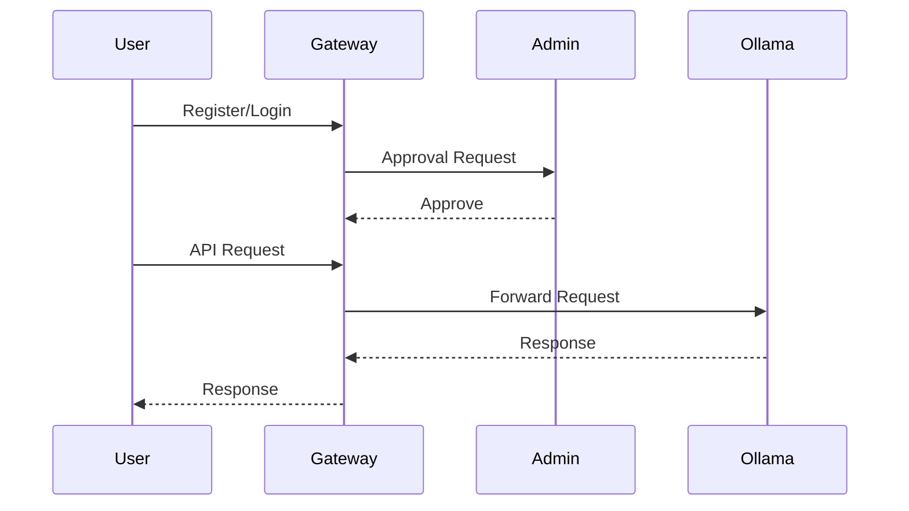
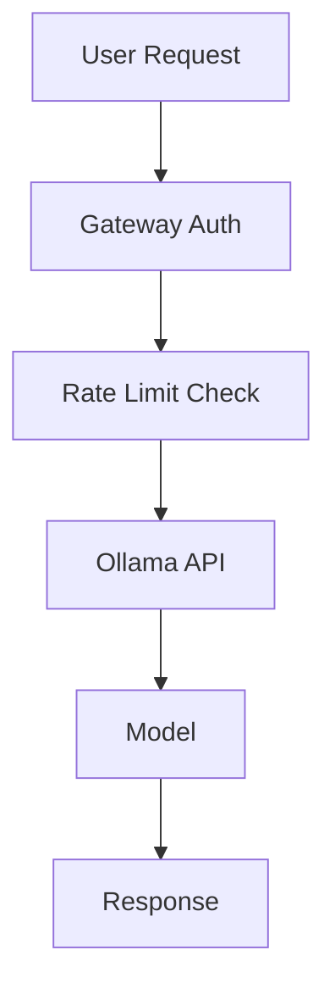

# Ollama LAN Gateway - Operations & Quick Test Guide

**Purpose:**
This document helps AI/ML team members quickly verify, restart, and test the **Ollama LAN Gateway**, including the Ollama backend and gateway control plane.

**Gateway Repo:**
https://github.com/855princekumar/ollama-lan-gateway

---

# 1. Architecture Overview



---

# 2. Service Control Plane

## Check Gateway Status

```bash
sudo systemctl status ollama-gateway.service
```

Expected:

```text
active (running)
```

---

## Restart Gateway

```bash
sudo systemctl restart ollama-gateway.service
```

---

## Stop Gateway

```bash
sudo systemctl stop ollama-gateway.service
```

---

# 3. Verify Ollama Backend

## Check Ollama Service

```bash
sudo systemctl status ollama
```

---

## Restart Ollama

```bash
sudo systemctl restart ollama
```

---

## Verify Ollama API Port

```bash
ss -tulnp | grep 11434
```

Expected:

```text
LISTEN 0 4096 0.0.0.0:11434
```

---

## Verify Installed Models

```bash
curl http://localhost:11434/api/tags
```

---

## Test Model Locally

```bash
curl http://localhost:11434/api/generate -d '{
  "model": "gpt-oss",
  "prompt": "test",
  "stream": false
}'
```

---

# 4. Gateway Access (LAN Users)

Base URL:

```text
http://<SERVER-IP>:7000
```

Example:

```text
http://10.1.40.47:7000
```

---

# 5. Gateway Health Check

```bash
curl http://<SERVER-IP>:7000/health
```

Expected:

```json
{
 "status": "healthy"
}
```

---

# 6. User Access Workflow



---

# 7. API Gateway Features

* User Authentication
* Admin Approval
* Rate Limiting
* Usage Logging
* LAN Access Control
* Ollama Proxy Routing

---

# 8. Troubleshooting Quick Guide

## Gateway Down

Check:

```bash
sudo systemctl restart ollama-gateway.service
```

Check logs:

```bash
journalctl -u ollama-gateway.service -f
```

---

## Ollama Down

Restart:

```bash
sudo systemctl restart ollama
```

Verify:

```bash
curl http://localhost:11434/api/tags
```

---

## Model Not Responding

Check models:

```bash
ollama list
```

Pull again if missing:

```bash
ollama pull gpt-oss
```

---

# 9. Port Reference

| Service        | Port  |
| -------------- | ----- |
| Ollama Gateway | 7000  |
| Ollama API     | 11434 |

---

# 10. Full Request Flow Summary



---

# 11. Validation Checklist (Quick)

Run all:

```bash
sudo systemctl status ollama-gateway.service
sudo systemctl status ollama
curl http://localhost:11434/api/tags
curl http://<SERVER-IP>:7000/health
```

---

# 12. Success Criteria

System is operational when:

* Gateway service active
* Ollama service active
* Models listed
* Gateway health returns OK
* User login & API works

---


