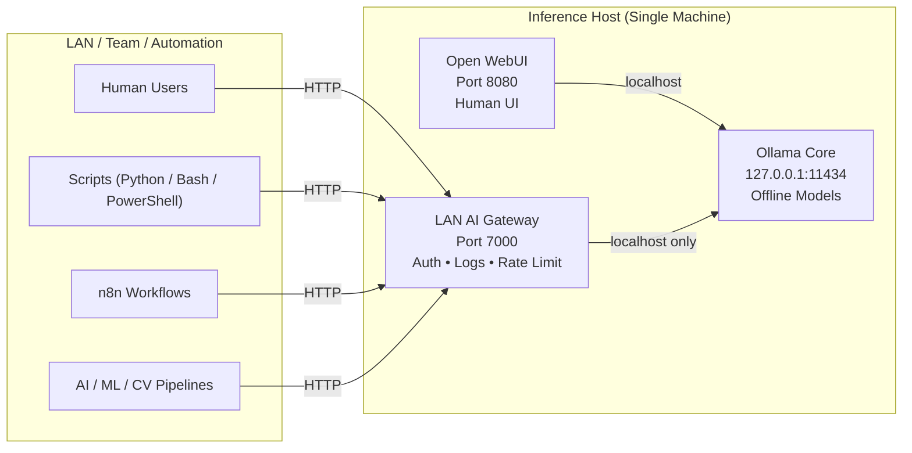

---
# Ollama LAN AI Gateway

**Authenticated, Audited, Rate-Limited API for Local LLMs (On-Prem)**


## 1. Why This Project Exists

This project was built to solve a **real, in-house operational problem** encountered while working with AI/ML, Computer Vision, DevOps automation, and research workflows.

Our teams were increasingly using:

* Free-tier cloud LLM APIs (privacy, cost, and rate-limit constraints)
* Local LLMs via Ollama for offline experimentation and validation
* Open WebUI for human interaction
* Automation tools (n8n, Python scripts, CI jobs) that **cannot safely rely on GUIs**

While Ollama is excellent as a local inference engine, it is **not designed** for:

* Multi-user access
* Authentication
* Rate limiting
* Audit logging
* Automation safety

At one point, a single automation script overwhelmed the local inference system, affecting other users and pipelines. There was **no visibility** into who sent what, when, or why.

This gateway was built as a **lightweight, production-safe middleware** to:

* Protect the core inference engine
* Isolate users
* Enable automation
* Provide auditability
* Maintain privacy and offline operation

---

## 2. Design Philosophy

* Ollama remains **localhost-only**
* Users never access the real inference API directly
* All access is authenticated and logged
* Rate limits protect system stability
* Minimal footprint, no system pollution
* Automation-first, UI-optional

---

## 3. High-Level Architecture



---

## 4. Core Security Boundary (Important)

> **The gateway must be installed on the same machine where Ollama is running.**

* The gateway communicates with Ollama only via:

  ```
  http://127.0.0.1:11434
  ```
* Ollama must never be exposed over LAN
* Users cannot bypass authentication or rate limits
* All external access is mediated by the gateway

This boundary is intentional and enforced.

---

## 5. Components Overview

| Component      | Role                                         |
| -------------- | -------------------------------------------- |
| Ollama         | Local inference engine, multi-model, offline |
| Open WebUI     | Optional human UI (port 8080)                |
| LAN AI Gateway | Authenticated, audited API (port 7000)       |
| SQLite (WAL)   | User, logs, audit storage                    |
| systemd        | Auto-start, auto-heal                        |

---

## 6. What This Gateway Adds

| Capability         | Ollama Native | Gateway |
| ------------------ | ------------- | ------- |
| LAN API            | No            | Yes     |
| Authentication     | No            | Yes     |
| Per-user isolation | No            | Yes     |
| Rate limiting      | No            | Yes     |
| Prompt logging     | No            | Yes     |
| Response logging   | No            | Yes     |
| CSV audit export   | No            | Yes     |
| Automation-safe    | Limited       | Yes     |

---

## 7. Access & User Management

### Base URL

```
http://<HOST_IP>:7000
```

Example:

```
http://10.1.45.69:7000
```

---

### Default Admin Account

* **Username:** `admin`
* **Password:** `admin123`

**Mandatory:**
Admin must change this password after first login.

---

### User Registration Flow

1. User visits the gateway URL
2. Registers using email and password
3. User status defaults to **pending**
4. Admin approves the user from admin dashboard
5. User gains API access

---

### Password Management

* Users can:

  * Reset password if they know the current password
* Admin can:

  * Reset any user password to `admin123`
  * Disable or revoke access instantly
  * Export user logs (CSV)
  * Permanently delete users (after audit export)

---

## 8. Rate Limiting

* Default: **10 requests per minute per user**
* Enforced at the gateway
* Prevents runaway scripts and system overload
* Applies equally to:

  * Scripts
  * Automation tools
  * CI pipelines

**Meaning:**
If more than 10 `/chat` requests are sent within one minute, further requests are rejected with HTTP `429`.

---

## 9. API Endpoints

### Health Check

```http
GET /health
```

Response:

```json
{ "status": "ok" }
```

---

### Core Inference API

```http
POST /chat
```

---

## 10. Request Format (Authentication Required)

Every request **must include authentication**:

```json
{
  "auth": {
    "username": "user@company.com",
    "password": "your_password"
  },
  "model": "llama3.2:latest",
  "messages": [
    { "role": "user", "content": "Hello" }
  ]
}
```

---

## 11. Usage Examples

### Linux / macOS (Terminal)

```bash
curl http://10.1.45.69:7000/chat \
  -H "Content-Type: application/json" \
  -d '{
    "auth": {
      "username": "user@company.com",
      "password": "password"
    },
    "messages": [
      {"role": "user", "content": "Explain MQTT in one sentence"}
    ]
  }'
```

---

### Windows (PowerShell)

```powershell
Invoke-RestMethod `
  -Uri "http://10.1.45.69:7000/chat" `
  -Method Post `
  -ContentType "application/json" `
  -Body '{
    "auth": {
      "username": "user@company.com",
      "password": "password"
    },
    "messages": [
      {"role": "user", "content": "Explain MQTT in one sentence"}
    ]
  }'
```

---

### Windows (CMD)

```cmd
curl http://10.1.45.69:7000/chat ^
 -H "Content-Type: application/json" ^
 -d "{\"auth\":{\"username\":\"user@company.com\",\"password\":\"password\"},\"messages\":[{\"role\":\"user\",\"content\":\"Explain MQTT\"}]}"
```

---

## 12. Response Format

Model output is always returned as:

```json
.message.content
```

Example:

```json
{
  "message": {
    "role": "assistant",
    "content": "MQTT is a lightweight publish-subscribe messaging protocol..."
  }
}
```

---

## 13. Model Selection (Current Process)

At present, model availability is:

* Managed centrally on the inference host
* Visible via **Open WebUI (port 8080)** for quick inspection
* Communicated by the admin to users

Users select models by name in the `/chat` request.

Example:

```json
"model": "qwen2.5:14b"
```

---

## 14. Automation & Pipelines

### Python Example

```python
import requests, json

payload = {
    "auth": {"username":"user@company.com","password":"password"},
    "model":"llama3.2:latest",
    "messages":[{"role":"user","content":"Is CPU usage 95% critical?"}]
}

r = requests.post("http://10.1.45.69:7000/chat", json=payload, timeout=180)
print(r.json()["message"]["content"])
```

---

## 15. Logging, Audit & Compliance

* Each request logs:

  * User ID
  * Prompt
  * Model response
  * Timestamp
* Stored in SQLite (WAL mode)
* Per-user CSV export supported
* Required before user deletion
* Useful for:

  * Research validation
  * Incident investigation
  * Automation debugging
  * Compliance review

---

## 16. Installation & Rollback

* Install script:

  * Creates isolated environment under `/opt`
  * Sets up database and systemd service
* Rollback script:

  * Removes gateway cleanly
  * Does not affect Ollama or other services

---

## 17. Roadmap / Upcoming Enhancements

The following features are planned and will be pushed as patches:

1. **Per-user rate limit management from admin dashboard**
2. **Authenticated model discovery via gateway API**

Until then:

* Rate limit is safely hard-coded to 10 req/min
* Model list is shared by admin or viewed via Open WebUI

---

## 18. Final Notes

This gateway is not a replacement for Open WebUI.
It is not a cloud LLM platform.

It is a **precise, lightweight solution** to a common operational gap:
secure, auditable, automation-friendly access to local LLMs.

Built because it was needed.
Shared because others face the same problem.

---


